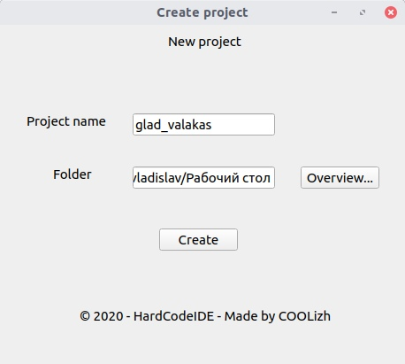
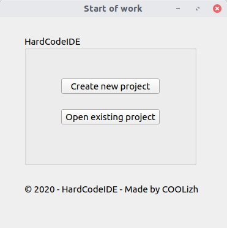
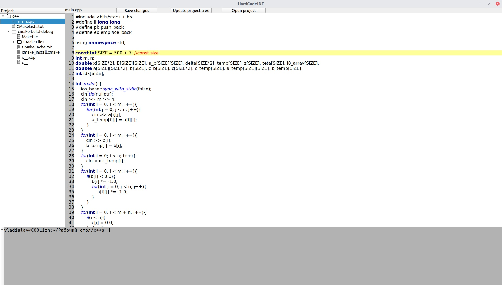

## Kulizhenko Vladislav, Group 753503, C++ IDE
#### The chosen technology:
-    Programming language: C++
-    Framework: Qt
#### The possibilities of the project:
-    Auto-completion of the code
-    Syntax highlighting
-    Own terminal
-    Building the project tree
-    Project creation and project opening
-    Saving file changes
#### Screenshots of the project

